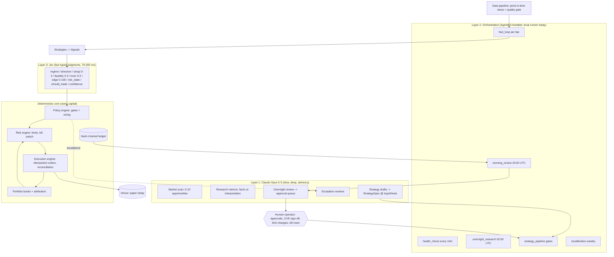

# One-Person 24/7 AI Hedge Fund: Blueprint

> **Status (2026-09-24).** The code in this repository implements every layer below and passes
> 103 tests. It runs in **paper mode only**. All five strategies sit at stage `data`: they are
> implemented and tested offline, but none has cleared a real-data gate. Nothing here is
> evidence that any strategy makes money. Synthetic-data results only show that the plumbing
> works. §17 lists what was verified and what was not.

---

## 1. Operating principles

1. **Survival first.** Hard limits are enforced by deterministic code that no model can
   bypass. Reducing risk is automatic. Adding risk back always takes evidence, and for LIVE
   it takes a named human.
2. **Models judge. Code decides.** Opus 5.5 writes research. Jev answers typed questions
   about market state. Position size, limits and orders are pure functions in `policy/`,
   `risk/` and `execution/`.
3. **Fail closed.** Missing data, a late Jev answer, an invalid Jev answer, a failed quality
   check or a reconciliation mismatch never trades. The only possible outcomes are "no new
   risk" or "flatten".
4. **One code path.** Backtest, paper, shadow and live use the same `build_stack()` and the
   same `DecisionPipeline`, so the tested code is the running code.
5. **Everything is evidence.** Every decision, order, fill, risk verdict, escalation, memo,
   approval and stage change goes into a hash-chained, append-only ledger. Promotions need
   evidence bundles from real data.
6. **Honesty over optimism.** Unverified APIs are marked unverified. Synthetic evidence can't
   clear a gate. Every probability is scored after the fact.

---

## 2. System architecture



**Trust boundaries**

| Component | Can | Cannot |
|---|---|---|
| Opus 5.5 | Read dated evidence and reports; write memos, spec drafts (stage `hypothesis` only) and approval requests | Place orders, size positions, change limits, promote strategies, reset the kill switch |
| Orchestration (AgentKit / runner) | Schedule workflows; run tests, backtests and gates; call the CLI; deploy after green CI | Bypass gates, edit `config/risk_limits.yaml` without a recorded approval, approve LIVE |
| Jev | Answer typed questions about a rendered market state | See NAV, positions or limits; output a size; override risk |
| Deterministic core | Size, veto, clip, flatten, execute, reconcile, demote/halt on invalidation | Increase risk beyond limits; act on unvalidated model output |
| Human operator | Approve LIVE and risk-limit changes, reset the kill switch, decide approval requests | Nothing structural stops you. Every action is logged with your name |

---

## 3. Fund structure

All eleven departments are defined in code (`hedgefund/orchestration/departments.py`). To
print them, run `python -m hedgefund org`.

| Department | Layer | Responsibilities | Workflows | Inputs → Outputs | Review |
|---|---|---|---|---|---|
| CIO | Opus + human | Research priorities, capital allocation proposals, chairs the IC | overnight_research, weekly allocation | Reports, metrics, calibration → allocation proposals | Operator approves every allocation change |
| Research Desk | Opus | Daily scan of 5-10 opportunities, memos, escalation reviews, failure analysis | overnight_research, escalation_review | Dated evidence, escalations → memos, hypotheses, drafts | Facts must be sourced and dated. IC reads a memo before its spec advances |
| Quant Desk | Orchestration + deterministic | Specs, signal code, backtests, costs, stress, deflated-Sharpe accounting | strategy_pipeline, recalibration | Hypotheses, PIT data → specs, code, evidence | Lifecycle gates. Synthetic evidence never passes |
| Fundamental Desk | Opus | Protocol revenue, supply/unlocks, valuation vs adoption | overnight_research | Fundamental sources → memos, catalyst calendars | Sourced facts. Unverified figures labelled |
| Macro Desk | Opus | Dollar liquidity, stablecoins, regulation | overnight_research | Stablecoin supply, evidence → regime memos, S4 | IC |
| On-Chain Desk | Opus + deterministic | Funding, OI, liquidations, flows | overnight_research, fast_loop | Funding/OI/stablecoin data → features, S1/S3 | IC |
| Portfolio Manager | Jev + deterministic | Per-bar loop, targets, attribution | fast_loop, evening_review | Data, signals, Jev → policy results, books | Every decision is in the ledger with its reasons |
| Risk Committee | Deterministic + human | Limits, kill switch, invalidation monitoring | fast_loop, overnight invalidation | Orders, NAV, metrics → verdicts, halts, demotions | Limit changes and kill resets need a named operator |
| Execution Desk | Deterministic | Routing, partial fills, cancel/replace, reconciliation, slippage | fast_loop | Approved requests → orders, fills | Slippage vs model reviewed nightly |
| Engineering Desk | AgentKit + human | CI, adapters, deploys, monitoring, incidents | deploy, health_check | Specs, incidents → code, releases | No deploy without green tests |
| Investment Committee | Gates + Opus + human | Gate evaluation, red-team, paper→shadow→live | strategy_pipeline | Evidence, memos → stage transitions | Gates are code. LIVE needs a human |

---

## 4. Repository structure

```
app.py, ict_master.db          existing ICT Pure Master licence admin (untouched)
config/
  fund.yaml                    fund config: mode, instruments & fee assumptions, Jev, research, schedule
  risk_limits.yaml             hard limits (Risk Committee; human approval to change)
  strategies/s1..s5_*.yaml     five machine-readable StrategySpecs
hedgefund/
  config.py                    typed config; refuses mode: live; enforces the 0.60 confidence floor
  core/                        types, clocks (Sim/System), ids, timeutil, hash-chained ledger
  data/                        series + point-in-time MarketView, features, synthetic generator,
                               live public sources, quality gate
  jev/                         schema + JevDecision validation, engine protocol, latency budget,
                               shadow, ReferenceJev (offline), RemoteJev (UNVERIFIED wire format)
  policy/engine.py             deterministic gates + sizing + hysteresis
  risk/                        RiskEngine (limits, scaling, drawdown/daily loss), KillSwitch
  execution/                   order state machine, Venue protocol, PaperVenue, ExecutionEngine,
                               token bucket
  portfolio/book.py            per-strategy books, funding, NAV, exposures
  strategy/                    spec + lifecycle gates + base class + monitor (invalidation)
    library/                   carry, trend, liquidation, stablecoin, relative_value
  pipeline.py                  signals -> Jev -> policy (shared by every mode)
  backtest/                    event-driven engine, metrics (PSR/DSR), stress, evidence
  calibration/                 Brier/log-loss/ECE, prediction tracker, Platt recalibration bundles
  research/                    Opus 5.5 client, schemas, prompts, evidence + workflow glue
  orchestration/               departments + workflow catalogue (the AgentKit contract)
  monitoring/                  alerts (ledger + webhook), health checks, daily report
  ops/                         assembly (build_stack), 24/7 runner
  cli.py, __main__.py          operator CLI
tests/                         103 tests: data, Jev, policy/risk, execution, strategies/lifecycle,
                               backtest/calibration, research/runner
.github/workflows/tests.yml    CI: lint, validate, test
```

---

## 5. Data pipeline

**Sources.** These are public, unauthenticated REST endpoints (`hedgefund/data/sources.py`):

| Data | Endpoint | Notes |
|---|---|---|
| Spot OHLCV | `GET https://api.binance.com/api/v3/klines` | Only closed bars. `Bar.ts` = close time |
| USD-M perp OHLCV | `GET https://fapi.binance.com/fapi/v1/klines` | |
| Funding history | `GET https://fapi.binance.com/fapi/v1/fundingRate` | 8-hourly on these contracts. Verify per contract |
| Open interest history | `GET https://fapi.binance.com/futures/data/openInterestHist` | Only ~30 days served, so it can't support long backtests (see §18) |
| Stablecoin supply | `GET https://stablecoins.llama.fi/stablecoincharts/all` | Aggregator history can be revised. Only snapshots taken at the time count |
| Global market | `GET https://api.coingecko.com/api/v3/global` | Dominance and total market cap, for research evidence |

**Guarantees.**
- *Point-in-time by construction.* Strategies, features and Jev states read only from
  `MarketView(t)`, which exposes records with `ts ≤ t`. `test_no_lookahead` checks that
  every strategy produces identical signals with and without the future data present.
- *O(1) features.* Rolling stats use prefix sums, which is how a 3,000-bar × 5-strategy
  backtest runs in about 4 s.
- *Quality gate* (`data/quality.py`). It checks staleness, recent gaps, OHLC consistency,
  non-positive prices and outlier moves. A failing symbol is blocked from new risk, and exits
  still run.
- *Provenance.* Every dataset carries its source, retrieval time and a `synthetic` flag.
  Research evidence cites them, and gates reject synthetic evidence.
- *Resilience.* Bounded exponential backoff on 429/5xx. Any failure raises
  `DataSourceError`, which leads to no trading and a high-severity alert.

**Still needed for production** (§18): a persistent point-in-time store (daily snapshots of
every source), a paid OI/liquidations history vendor, and a second price source for
cross-checking.

---

## 6. Market research process (Opus 5.5)

`python -m hedgefund research scan` (and the nightly `overnight_research` workflow) works in
three steps:

1. `market_evidence()` computes dated metrics from the fund's own data: returns (7/30/90d),
   realized vol, 7d funding, 7d OI change, ETH/BTC, and stablecoin growth (30/90d). Each
   metric carries its source and as-of time.
2. Opus 5.5 gets the evidence inside `<evidence>` tags, which the system prompt marks as data
   and not instructions. It returns a schema-valid `MARKET_SCAN` with 5-10 opportunities.
   Each has a thesis, why it's mispriced, sourced facts, interpretation, catalysts (with a
   priced-in assessment), competition, bear case, invalidation conditions, asymmetry,
   horizon, confidence, a testable hypothesis and the data it needs.
3. The result is stored in the ledger. Promising hypotheses become memos
   (`research memo --topic ... --draft-strategy`), and the draft is converted into a
   `StrategySpec` at stage `hypothesis`, validated, and written to `var/drafts/` for review.

Standing research themes the desks scan every day: BTC/ETH trend and dominance, stablecoin
net issuance, funding and basis, OI and liquidation clusters, macro liquidity, sector
rotation, protocol revenue vs valuation, TVL, token unlock overhangs, ETF and institutional
flows, regulation, and emerging narratives. These are **themes, not claims**. This document
deliberately lists no current opportunities, because any list written here would be stale
and unsourced. The daily scan produces them from live, dated evidence.

**Implementation details** (`hedgefund/research/opus.py`): official Anthropic SDK, model
`claude-opus-5-5`, streaming with `get_final_message()`, structured outputs via
`output_config.format` (closed JSON schemas, checked by `test_schemas_are_closed`), and
`effort: high`. There's no `thinking` parameter because thinking is always on for Opus 5.5
and effort is the control. There's no forced `tool_choice`. The cached system prompt is
byte-stable. The client handles `refusal` and `max_tokens` stops. SDK retries cover
429/5xx.

---

## 7. Strategy pipeline

`observation → hypothesis → data → signal → backtest → cost_model → stress_test → risk_review → paper_trade → shadow_mode → live`

Promotion moves one step at a time and needs evidence that passes the target's gate
(`hedgefund/strategy/lifecycle.py`). Demotion to `paper_trade` or `retired` is always
allowed with a reason, and `retired` is final.

| Target stage | Evidence required |
|---|---|
| hypothesis | `observation.memo_id` |
| data | Testable prediction stated. Spec validates |
| signal | Data quality ok, ≥365 days of history, point-in-time. **Real data** |
| backtest | Implementation registered, tests pass, look-ahead test passes |
| cost_model | ≥30 trades, net Sharpe ≥0.5, PSR ≥0.80, **DSR ≥0.50** (deflated for every trial in the ledger), max DD ≤25%, ≥60% positive time folds. **Real data** |
| stress_test | Sharpe ≥0.3 at 2× fees, ≥0.2 at 3× slippage, ≥0.2 with 2 extra bars of delay. **Real data** |
| risk_review | Stress passed (incl. a 30% correlated crash), worst DD ≤35%, no parameter cliff at ±20%. **Real data** |
| paper_trade | Limits compatible, correlation to book ≤0.7, capacity ok |
| shadow_mode | ≥14 paper days, ≥10 trades, slippage ≤1.5× model, Brier(should_trade) ≤0.25, 0 incidents |
| live | ≥7 shadow days, decision parity ≥95%, fill deviation ≤10 bps, venue adapter verified, **named human approval**. **Real data** |

The tooling is `backtest --stress --perturb --evidence-out ev.json`, then
`promote <id> --to <stage> --evidence ev.json [--operator you --reason ...]`, with
`stages` showing what each strategy needs next.

**Invalidation.** Every spec has machine-readable kill criteria, for example
`rolling_sharpe_90d < 0` → demote and `strategy_drawdown > 4%` → halt. Each night
`strategy/monitor.py` computes the metrics from the ledger and applies demotions and halts
automatically, because those only reduce risk.

---

## 8. Jev decision schemas

Each strategy compiles a `JevSchema` from its spec (`jev/schema.py`). The eight typed
questions map to Jev's three primitives:

| Key | Type | Answer space | Used by policy as |
|---|---|---|---|
| regime | Choice | trending / mean_reverting / high_vol / crisis | Allowed-regime gate; crisis → escalate + exit per spec |
| direction | Choice | long / short / flat | Must equal the strategy's signal direction |
| setup_quality | Score (4 levels) | 0-3 | ≥ spec minimum; size multiplier {0, .25, .6, 1} |
| liquidity_quality | Score (4 levels) | 0-3 | ≥ spec minimum; size multiplier |
| toxic_flow | Score (4 levels) | 0-3 | ≤ spec maximum |
| expected_edge | Score (5 levels) | 0-100 (probability-weighted level position) | ≥ spec minimum |
| risk_state | Choice | safe / reduce / flat | flat → exit; reduce → cap at half size, no adds |
| should_trade | Noul (yes/no prob) | p ∈ [0,1] | Must be yes (p ≥ 0.5) |
| confidence | derived | min of regime, direction, risk_state and should_trade confidences | < max(0.60, spec min) → no new risk; < 0.60 → escalate |

Strategy-specific instructions are appended to each question (e.g., carry: *"'long' means
long spot / short perp carry is attractive"*). The Jev state is a deterministic text
rendering of the features plus the strategy's thesis. Its hash, the schema hash and the
model version are logged with every decision.

**Engines.** `ReferenceJev` is offline, deterministic and transparent. It's the default for
backtests and paper runs, the fallback, and the shadow baseline. `RemoteJev` is the HTTP
adapter. It refuses to start until the wire format is verified. `BudgetedJev` treats a late
answer as no answer. `ShadowJev` logs disagreements between two engines. `RecalibratedJev`
applies a versioned calibration bundle.

**Escalation** is edge-triggered per package. It fires when confidence drops below 0.60 or
the regime turns crisis, not on every bar the condition persists. Escalations are grouped
into review tasks for Opus each night.

---

## 9. Policy and risk engine

**Policy** (`policy/engine.py`). Rules apply in order of precedence, first match wins:

1. Strategy exit signal → EXIT. Exits never wait for Jev.
2. Jev unavailable, invalid or halted, data gate failed, or bar volume below the spec
   minimum → no new risk and hold.
3. Crisis → escalate. EXIT if `exit_on_crisis`.
4. Confidence below the required level → no new risk. Escalate if below 0.60.
5. risk_state flat → EXIT. reduce → cap at half the base size, with no repeated halving.
6. All entry gates pass → ENTER or ADJUST. Otherwise HOLD the existing position or NO_TRADE.

**Sizing** is deterministic:
`notional = min(NAV × min(spec.risk_per_trade, limits.max_risk_per_trade) / stop_distance × m_setup × m_liq × m_conf, NAV × spec.max_package_notional)`.
Hysteresis prevents fee churn: a position shrinks only when it's above the full-quality risk
budget and grows only when the quality-adjusted target is materially larger. This change
roughly halved carry-strategy fees in testing.

**Risk** (`risk/engine.py`, limits in `config/risk_limits.yaml`):

| Limit | Default | Behaviour |
|---|---|---|
| Max drawdown from HWM | 15% | Latching kill switch. Flatten all. Human reset |
| Drawdown soft limit | 10% | Reduce-only mode |
| Daily loss (UTC) | 3% | No new risk until the next UTC day |
| Per-instrument position | 25% NAV | Clip, or reject if below 10% of the request |
| Gross / net leverage | 1.5× / 1.0× | Clip or reject |
| Correlated cluster net | 60% NAV | Clip or reject |
| Participation | 2% of previous bar notional | Clip or reject |
| Estimated slippage | 30 bps | Clip or reject |
| Order rate | 30/min | Reject (exits bypass) |
| Risk per trade | 1.5% NAV cap | Caps each spec's budget |
| Reconciliation tolerance | 0.1% NAV | Mismatch → kill switch |
| Jev confidence floor | 0.60 | Hard-coded floor. Config can raise it, not lower it |

Multi-leg packages are scaled **uniformly** so hedges stay hedged. Orders that strictly
reduce exposure are always allowed, even with the kill switch engaged. A limit that's already
breached (say, after a price move) blocks only orders that would make it worse. The kill
switch can also be engaged by `touch var/KILL_SWITCH`, which works even if Python is hung.

---

## 10. Execution engine

`execution/engine.py` + `orders.py` + `paper.py` + `venue.py`:

- **State machine**: `new → submitted → acked → partially_filled → filled | canceled | rejected | expired`.
  Illegal transitions raise an error.
- **Idempotency**: client order ids are `sha256(strategy, package, decision ts, action, decision_id, symbol)`.
  Re-running a step can't double-submit (`test_execute_is_idempotent`).
- **Unknown outcomes**: after a timeout the engine queries by client id **before**
  resubmitting, and resubmits only with the same id (`test_lost_ack_is_queried_not_duplicated`).
- **Retries**: transient errors only, bounded, with exponential backoff. Permanent errors
  reject immediately. When retries run out, an alert fires.
- **Rate limits**: a token bucket sits in front of the venue. The risk engine has its own
  runaway-loop guard.
- **Partial fills and cancel/replace**: fills continue across steps. A new decision cancels
  the package's open orders first. Orders older than the TTL are cancelled and re-decided.
- **Separation of duties**: policy produces targets, risk approves or clips, and only then
  does execution submit.
- **Reconciliation**: internal books are compared with venue positions every loop. A
  mismatch engages the kill switch. A fault-injection test (30% 503s + 30% lost acks)
  finishes reconciled.
- **Audit**: every order and fill is logged with `strategy_id`, `decision_id`,
  `model_version`, `expected_price`, `actual_price`, `slippage_bps`, fee and realized PnL.

The only venue is `PaperVenue`, which models spread + √participation impact, per-step
liquidity caps and fault injection. A live adapter has to implement the `Venue` protocol and
pass the contract tests against the venue's testnet before the LIVE gate
(`shadow.venue_adapter_verified`) can pass.

---

## 11. Continuous operation (UTC)

| When | Workflow | What happens |
|---|---|---|
| Every bar close + 20 s (4h bars) | `fast_loop` | Data → quality gate → mark/funding → risk state → signals → Jev → policy → risk → execution → reconcile → NAV snapshot → health |
| Every 15 min | `health_check` | Kill switch, drawdown, data freshness, Jev p50/p99 and error rate, reconciliation, stale orders, escalation volume |
| 20:00 | `evening_review` | Daily report (`var/reports/YYYY-MM-DD.md`): NAV, books, activity, slippage, risk events, calibration, pending approvals |
| 02:00 | `overnight_research` | Resolve calibration → invalidation (demote/halt) → verify ledger → Opus scan + escalation reviews + overnight review → approval queue |
| Weekly | `recalibration` | Fit, holdout-test and replay-test a Jev calibration bundle, then send it to the approval queue |

The runner survives restarts because it rebuilds books, funding, HWM, pending calibration
predictions and halts from the ledger. It's also idempotent per bar, backs off on errors,
writes `var/heartbeat.json` for an external watchdog, and shuts down cleanly on SIGTERM.

---

## 12. Learning and calibration

- **Every Jev probability is recorded** (`CALIBRATION_PREDICTION`) and resolved against
  realized data with fixed outcome definitions. `should_trade` means the package's forward
  return, including funding and minus the spec's round-trip costs, is above zero over the
  spec's horizon. `direction` means the package moved the predicted way. `regime` means the
  forward window's ex-post label matches.
- **Scores**: Brier, Brier skill vs base rate, log loss, ECE and reliability bins, grouped by
  `(model_version, strategy, question)`. These feed the daily report and the invalidation
  rules (e.g., `brier_should_trade > 0.25` → demote).
- **Controlled versioning** (`calibration/recalibrate.py`): Platt maps are fitted on older
  predictions and **accepted only if holdout Brier improves**. Maps whose slope comes out
  zero or negative are refused and flagged as "no positive skill: investigate". That rule
  exists so recalibration can't quietly invert a broken signal. Bundles are
  content-addressed (`model_version = reference-jev-1.0+cal-<hash>`), integrity-checked on
  load, replay-tested with a full backtest, and enabled only after approval.
- **Replay before deploy**: any new schema, bundle or engine is run through
  `run_backtest(..., jev=<candidate>)` on the same data as the incumbent, and can then run as
  `shadow_engine` in production.
- **Failure analysis**: the overnight Opus review gets the daily report and calibration
  tables and proposes investigations. Nothing gets applied without approval.

On synthetic data the reference model's calibration is **poor for several questions**, and
the system reports that honestly. That's the point: a heuristic Jev earns no trust by being
simple, and the tooling shows where it's wrong.

---

## 13. Monitoring and alerting

- Every alert goes to the ledger. High and critical alerts also go to a Slack-compatible
  webhook (`ALERT_WEBHOOK_URL`). Duplicates are suppressed for an hour.
- Kill-switch engagement pages once per engagement, however it was engaged.
- `python -m hedgefund status | health | report | calibration | verify-ledger`.
- External watchdog: alert if `var/heartbeat.json` is older than two bars.

---

## 14. Interfaces between the layers

| Interface | Direction | Contract | Code |
|---|---|---|---|
| Data → strategies/Jev | in | `MarketView(t)` (point-in-time), `standard_features()` | `data/series.py`, `data/features.py` |
| Strategy → policy | in | `Signal(strategy_id, package, legs, direction, stop_distance_pct, ts, thesis, features)` | `core/types.py` |
| Deterministic → Jev | out | `JevState.text()` + `JevSchema` (typed questions) | `jev/schema.py` |
| Jev → deterministic | in | Typed answers → validated `JevDecision`, or `JevUnavailable`/`JevSchemaError` (both fail closed) | `jev/schema.py`, `jev/engine.py` |
| Policy → risk → execution | internal | `PolicyResult(leg_targets)` → `OrderRequest` → `RiskVerdict` → `Order` | `policy/`, `risk/`, `execution/` |
| Deterministic → Opus | out | Dated evidence JSON, daily report markdown, escalation tasks | `research/pipeline.py` |
| Opus → system | in | Schema-valid JSON → ledger memos, `StrategySpec` @ hypothesis, `APPROVAL_REQUEST`s | `research/opus.py`, `research/schemas.py` |
| Orchestration → system | control | Workflow names in `WORKFLOWS`, the CLI as the tool surface, the ledger as shared state, gates as acceptance tests | `orchestration/`, `cli.py` |
| Human → system | control | `approve`, `promote --operator`, `reset-kill`, `kill`, edits to `risk_limits.yaml` + `approve risk_limits_change` | `cli.py` |

---

## 15. AgentKit six-phase build plan

AgentKit is meant to run the engineering layer. Its public site (agentkit.xyz) couldn't be
reached from the build environment, so the contract below is this repo's own: each phase is
a self-contained work order with exact file paths and acceptance tests that an AgentKit team
(or a person) can execute. Phases 1-6 are **built in this commit**. The "Next" items are
where the remaining work is.

| Phase | Goal | Files | Acceptance | Next |
|---|---|---|---|---|
| **1. Foundations** | Types, clocks, ids, audit ledger, typed config with hard floors | `hedgefund/core/{types,clock,ids,timeutil,ledger}.py`, `hedgefund/config.py`, `config/fund.yaml`, `config/risk_limits.yaml`, `pyproject.toml`, `.github/workflows/tests.yml` | `tests/test_core_data.py` (ledger append-only, tamper detection, reopen; live mode refused; floor enforced) | Off-box ledger replication (e.g. nightly signed export) |
| **2. Data** | Point-in-time data, features, quality gate, sources, synthetic generator | `hedgefund/data/{series,features,quality,sources,synthetic}.py` | `test_view_never_sees_the_future`, `test_prefix_sum_stats_match_naive`, `test_quality_gate_*`, `test_kline_parsing_drops_open_bar` | PIT snapshot store; OI/liquidation vendor; second price source; live-endpoint smoke tests from an unblocked region |
| **3. Decision core** | Specs, 5 strategies, Jev schema/engines, policy | `hedgefund/strategy/{spec,base}.py`, `hedgefund/strategy/library/*.py`, `config/strategies/*.yaml`, `hedgefund/jev/*.py`, `hedgefund/policy/engine.py`, `hedgefund/pipeline.py` | `tests/test_jev.py`, `test_no_lookahead[*]`, `tests/test_policy_risk.py::test_every_entry_gate[*]`, hysteresis tests | Verify the Jev wire format against official docs; record a real response fixture; run RemoteJev in shadow |
| **4. Risk & execution** | Limits, kill switch, books, idempotent execution, reconciliation | `hedgefund/risk/{engine,kill_switch}.py`, `hedgefund/portfolio/book.py`, `hedgefund/execution/{orders,venue,paper,ratelimit,engine}.py` | `tests/test_policy_risk.py` (risk), `tests/test_execution.py` (state machine, idempotency, lost acks, fault injection, flatten, reconciliation) | Live `Venue` adapter + testnet contract tests; margin/liquidation model for perps; per-venue exposure limits |
| **5. Research, backtest & learning** | Backtester on the production stack, PSR/DSR, stress, evidence, calibration and recalibration, Opus research | `hedgefund/backtest/{engine,metrics,stress}.py`, `hedgefund/calibration/{metrics,tracker,recalibrate}.py`, `hedgefund/research/{opus,schemas,prompts,pipeline}.py`, `hedgefund/strategy/lifecycle.py` | `tests/test_backtest_calibration.py`, `tests/test_strategy_lifecycle.py`, `tests/test_research_runner.py` (Opus request shape, closed schemas, advisory-only writes) | Real-data backtests for S1-S5 (≥1y), trial accounting across param sweeps, first real calibration bundle |
| **6. Operations** | 24/7 runner, schedules, health, alerts, reports, departments/workflows, CLI | `hedgefund/ops/{assembly,runner}.py`, `hedgefund/monitoring/{alerts,health,report}.py`, `hedgefund/orchestration/{departments,workflows}.py`, `hedgefund/strategy/monitor.py`, `hedgefund/cli.py` | `tests/test_research_runner.py` (idempotent per bar, restart-safe, data outage fails closed, kill switch flattens + pages, idle by default) | Process supervisor (systemd/container) + heartbeat watchdog; secrets management; host AgentKit workflows against `WORKFLOWS` |

---

## 16. The first five strategies

All five are specified in `config/strategies/` and implemented in `hedgefund/strategy/library/`.
Every one is **at stage `data`**. The theses below are hypotheses to test, not claims of
edge.

### S1: BTC perpetual funding carry (delta-neutral), `carry_btc_basis`
- **Thesis**: leveraged long demand for perps is persistent and not price-sensitive, so
  funding is positive on average and spikes in leverage build-ups. Long spot / short perp
  collects it with near-zero price exposure. It's a **risk premium** for carrying basis,
  exchange and liquidation risk, not a forecast.
- **Rules**: enter when 3-day average funding is ≥15% annualized, the last print is > 0, and
  |basis| < 1%. Exit when funding is ≤3%, after 2 negative prints, or when |basis| ≥ 2%.
  Holding 1-6 weeks. Round-trip costs are about 34 bps, so it breaks even after roughly a
  week at 15%.
- **Data**: spot and perp klines, funding history, OI.
- **Failure modes**: venue insolvency or withdrawal freeze (both legs on one venue);
  ADL/liquidation of the short leg; crowding compressing funding; basis blow-out in a crash.

### S2: Time-series momentum on BTC/ETH perps, `tsmom_majors`
- **Thesis**: slow diffusion of information and pro-cyclical flows produce multi-week
  continuation when the 20/60/120-day returns agree and the path is efficient. The edge is
  small per trade and comes from catching the right tail.
- **Rules**: enter when all three horizons agree and the 10-day efficiency ratio is ≥0.25.
  Exit when the majority flips. The stop is 2 × daily vol × √10 (min 5%). Holding 2-12 weeks.
- **Data**: perp klines and funding. Funding is a real drag on crowded long trends.
- **Failure modes**: whipsaw regimes; gaps through stops; BTC and ETH trends are about 1.2
  independent bets, not 2.

### S3: Liquidation-cascade reversion, `liq_cascade_reversion`
- **Thesis**: forced sellers don't care about price. After OI has flushed and funding has
  reset, the forced flow is spent and price partly reverts. The fund gets paid for providing
  liquidity **after** the flow clears, never into it (Jev `toxic_flow ≤ 1` enforces this).
- **Rules**: enter when the 1-day return z ≤ −2, OI change over 1 day ≤ −5%, and funding
  ≤ 5% annualized. Take profit at +1.5σ, stop at −1.5σ, time stop at 18 bars (3 days).
- **Data**: perp klines, funding, **OI history**. Public OI history covers only ~30 days, so
  real-data evidence needs a vendor.
- **Failure modes**: informational drops (hack, insolvency, regulation); a second-wave
  cascade; few trades per year, so thin statistics.

### S4: Stablecoin-liquidity regime tilt (spot BTC), `stablecoin_liquidity_tilt`
- **Thesis**: net stablecoin issuance stands in for fresh dollar liquidity. Expansion,
  confirmed by price above the 200-day SMA, marks risk-on regimes. This is a slow filter,
  spot only, no leverage.
- **Rules**: enter when 30-day supply growth is ≥1% and close > 200-day SMA. Exit when growth
  < 0 or close < SMA × 0.98. Holding 1-6 months.
- **Data**: spot klines and point-in-time stablecoin supply snapshots.
- **Failure modes**: supply growth driven by payments or treasury demand rather than risk
  appetite; data revisions; few regime switches; overlap with S2.

### S5: ETH/BTC relative value, `ethbtc_rv`
- **Thesis**: short-horizon deviations of ln(ETH/BTC) from its 30-day mean are partly
  transient flow and revert **when the ratio isn't trending**. A dollar-neutral pair
  removes most market beta.
- **Rules**: enter when |z| ≥ 2 and the ratio's efficiency ratio < 0.30 (fade the
  deviation). Exit at |z| ≤ 0.5, stop at |z| ≥ 3.5, time stop at 20 days.
- **Data**: perp klines and funding for both legs.
- **Failure modes**: structural ratio trends (multi-month ETH under- or out-performance);
  leg-specific news; dollar-neutral ≠ beta-neutral (ETH beta is about 1.1-1.3).
- **Caveat about the synthetic tests**: the synthetic generator models the ETH/BTC ratio as
  mean-reverting, so S5 "working" on synthetic data is circular. Only real data can say
  anything.

Cross-strategy correlation: S2 and S4 overlap in bull regimes. S1 and S4 both hold spot BTC,
and the 25% per-instrument cap binds on their combined position (seen in testing: S4's entry
was correctly rejected). The cluster limit treats every crypto instrument as one correlated
bet.

---

## 17. Verified vs. unverified

| Item | Status |
|---|---|
| Anthropic SDK usage (`claude-opus-5-5`, `messages.stream`, `output_config.format` + `effort`, cached system prompt, refusal handling) | Written against the SDK documentation bundled with Claude Code. SDK 1.8.0's `messages.stream` signature checked. Request shape unit-tested with a fake client. **No live API call was made.** |
| Binance / DefiLlama / CoinGecko endpoints | Public endpoints known from training. **Not reachable from the build environment** (the proxy blocked Binance). Parsing is unit-tested on fixtures. Run a live smoke test before relying on them. Binance geo-restricts some jurisdictions |
| Jev (TypeSafe) | Public descriptions (Sept 2026) say: state + typed questions (Choice, Score with 2-10 levels, Noul yes/no probability), calibrated confidence, 70-500 ms. **The official API reference couldn't be reached**, so `RemoteJev`'s field names are provisional and it refuses to run until `JEV_WIRE_FORMAT_VERIFIED=1` |
| AgentKit (agentkit.xyz) | Described publicly as turning a prompt into a quant engineering team that builds the system Jev plugs into. **The site couldn't be reached**, so no AgentKit API is used or assumed. The orchestration contract (`WORKFLOWS`, CLI, ledger, gates) is this repo's own |
| Fees, spreads, impact coefficients | **Assumptions**, modelled on published base-tier taker rates. Check them against your account tier |
| Strategy performance | **Unknown.** Only synthetic tests exist |

Sources consulted: public descriptions of TypeSafe Jev (docs.aimlapi.com, jevapi.org,
marktechpost.com, 2026-09-19) and of AgentKit + Jev (x.com/RohOnChain), via web search. The
primary docs (docs.typesafe.ai/api, agentkit.xyz) were blocked by the network.

---

## 18. Go-live checklist (none of this is done yet)

1. Build a **point-in-time data store** that snapshots every source daily. Buy OI and
   liquidation history.
2. Run **real-data backtests** for S1-S5 over at least a year (`--live-data`), with trial
   accounting, then stress and perturbation tests. Promote only on real evidence.
3. **Verify the Jev wire format**, record a real response as a fixture, and run RemoteJev as
   `shadow_engine` next to ReferenceJev for at least 2 weeks. Compare calibration.
4. Write a **live venue adapter** and pass the `Venue` contract tests on the venue's
   testnet: idempotent client ids, query-by-client-id, cancel, positions. Add a perp margin
   and liquidation model.
5. **Paper-trade at least 14 days, then shadow at least 7 days** in production
   infrastructure. Compare fills with the model.
6. Operations: a process supervisor, a heartbeat watchdog, secrets in a vault, an off-box
   ledger backup, and a tested runbook for "kill switch engaged at 3 a.m.".
7. **Start with small capital.** The LIVE gate requires your named approval. Raise
   allocation only through the approval queue.

---

## 19. WHAT COULD I BE WRONG ABOUT?

**Is the edge real, or driven by incentives?**
- S1 (carry) is a risk premium. The fund gets paid *because* the tail is ugly: venue
  failure, ADL, basis blow-outs. Many carry trades earn steadily until one event wipes out
  years of it. Delta-neutral products and cash-and-carry ETFs compete for the same premium
  and can compress it for good.
- S2 (trend) and S5 (RV) are well known. Any edge may already be arbitraged down to cost,
  and only real data with deflated Sharpe can separate edge from multiple testing.
- Opus-generated ideas are drawn from what's written about markets, which leans toward
  narratives that are already crowded. The research layer is prompted to ask "is this real
  or incentive-driven?", but a model can't be fully trusted to spot its own bias.

**Is the catalyst already priced in?** Public catalysts (unlocks, ETF flows, upgrades) are
usually priced before they happen. The scan schema forces a "priced-in assessment", but
that's an opinion, not a measurement. Nothing trades on it without a backtestable rule.

**Will it survive costs and slippage?** Costs are modelled, but the fee and impact numbers
are assumptions. S1 needs about a week of carry to cover round-trip costs. S3 enters right
after stress, when spreads are widest. The `fees_2x` / `slippage_3x` / `delay_2` gates exist
for this reason, and in paper the slippage-ratio gate (≤1.5× model) checks the model itself.

**What could make Jev confidently wrong?**
- Distribution shift: states unlike anything it was trained or calibrated on (new market
  structure, a stablecoin depeg, an exchange halt).
- The state rendering. Jev sees only the features given to it. If the relevant fact isn't
  in the state (a hack headline, a delisting), Jev can be confident and blind.
- Question framing: a changed instruction can change answers. Schema hashes are logged and
  schema changes go through replay.
- Calibration measured in aggregate can hide poor calibration in the tails, and the tails
  are where the losses happen. Some of the reference model's questions already show
  negative Brier skill on synthetic data. The system flags this rather than trusting it.
- Mitigation: Jev never sizes, confidence gates are floors, crisis and low confidence
  escalate, calibration is scored per strategy and question, and negative skill blocks
  recalibration and triggers investigation.

**What if liquidity disappears?** The participation (2%) and slippage (30 bps) limits use the
*previous* bar's volume, so a sudden liquidity vacuum still trades against stale volume for
one bar. Exits are allowed to breach participation limits because survival comes first,
which means exit slippage in a crash can be far worse than modelled. The PaperVenue can't
simulate a real order book vanishing.

**What if the regime changes?** Every strategy has kill criteria, and Jev gates regimes, but
invalidation rules are slow by design (e.g., 540 observations before a Sharpe-based
demotion). Hard drawdown halts are the fast backstop. A regime change that shows up as a
slow bleed is the hardest case.

**What if data feeds fail?** A total outage is handled (no trading, alert). The dangerous
case is a feed that is *wrong but plausible*: a stale price that still passes the staleness
check, or a revised history. There's only one price source today. A second source and
cross-checks are on the go-live list.

**What if several strategies are correlated?** S1 and S4 both hold spot BTC. S2 and S4 are
both long in bull regimes. All four instruments sit in one "crypto_beta" cluster capped at
60% net. In a crash, correlations go to 1 and the cluster cap is the real limit. The gross
leverage cap (1.5×) and the 15% drawdown kill switch are the last lines of defence, and a
gap move can go straight through both before the next bar.

**What about the system itself?**
- Perp positions are modelled as fully collateralized, with no margin or liquidation
  engine. Live leverage would need one.
- A single venue concentrates counterparty risk. There's no per-venue exposure limit yet.
- The ledger is local SQLite. A disk loss without off-box backup would lose the audit trail.
- The operator is a single point of failure for approvals and kill-switch resets, so
  trading stays flat until you respond. That's deliberate, but it costs opportunities.
- The Jev and AgentKit integrations rest on public descriptions, not verified API docs.

**Bottom line**: the architecture puts survival, reproducibility and risk-adjusted returns
ahead of raw returns. Whether any of the five strategies has a real edge is **not yet
known**, and the system is built so it won't find out with real money first.
